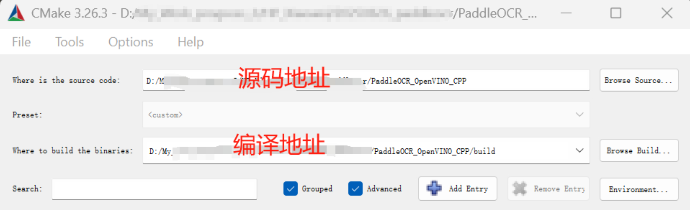
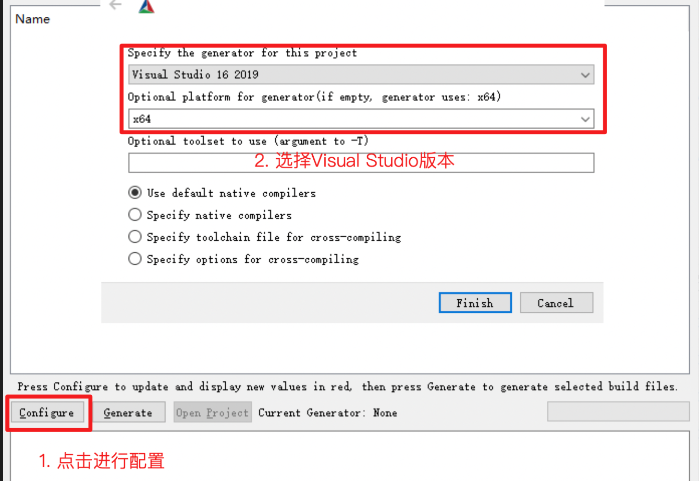
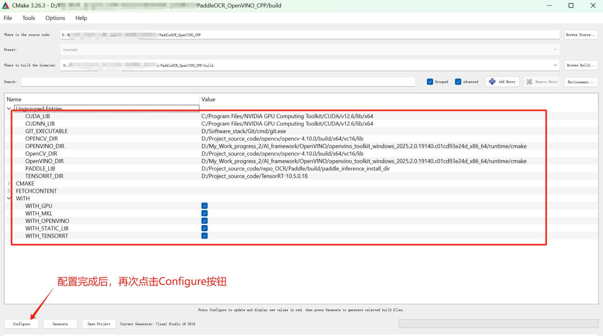
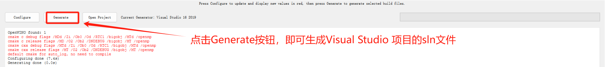
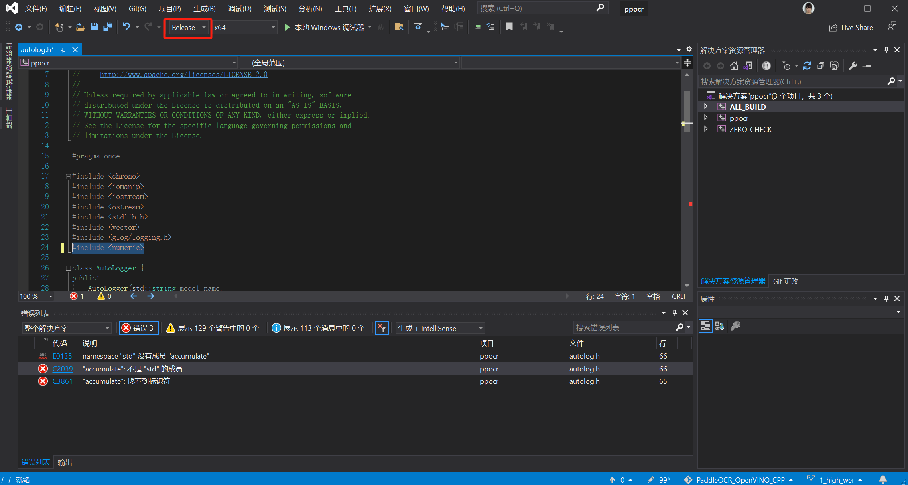
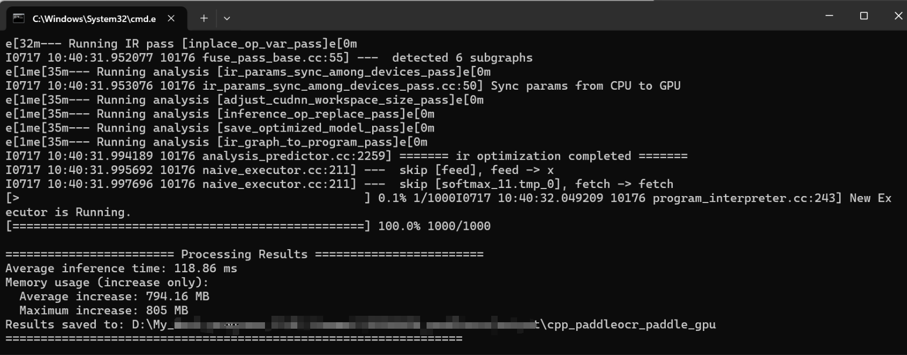

[English](windows_vs2022_build.md) | 简体中文

- [Visual Studio 2019 Community CMake 编译指南](#visual-studio-2019-community-cmake-编译指南)
  - [1. 环境准备](#1-环境准备)
    - [1.1 安装必须环境](#11-安装必须环境)
    - [1.2 下载 PaddlePaddle C++ 预测库和 Opencv](#12-下载-paddlepaddle-c-预测库和-opencv)
      - [1.2.1 下载 PaddlePaddle C++ 预测库](#121-下载-paddlepaddle-c-预测库)
      - [1.2.2 安装配置OpenCV](#122-安装配置opencv)
      - [1.2.3 下载OpenVINO](#123-下载openvino)
  - [2. 开始运行](#2-开始运行)
    - [Step1: 构建Visual Studio项目](#step1-构建visual-studio项目)
    - [Step2: 执行cmake配置](#step2-执行cmake配置)
    - [Step3: 生成Visual Studio 项目](#step3-生成visual-studio-项目)
    - [Step4: 预测](#step4-预测)
  - [FAQ](#faq)

# Visual Studio 2019 Community CMake 编译指南

PaddleOCR在Windows 平台下基于`Visual Studio 2019 Community` 进行了测试。微软从`Visual Studio 2017`开始即支持直接管理`CMake`跨平台编译项目，但是直到`2019`才提供了稳定和完全的支持，所以如果你想使用CMake管理项目编译构建，我们推荐你使用`Visual Studio 2019`环境下构建。


## 1. 环境准备
### 1.1 安装必须环境

* Visual Studio 2019
* CUDA 12.6，cudnn 9.5.1 （仅在使用GPU版本的预测库时需要）
* CMake 3.22+

请确保系统已经安装好上述基本软件，我们使用的是`VS2019`的社区版。

### 1.2 下载 PaddlePaddle C++ 预测库和 Opencv

#### 1.2.1 下载 PaddlePaddle C++ 预测库

PaddlePaddle C++ 预测库针对不同的`CPU`和`CUDA`版本提供了不同的预编译版本，请根据实际情况下载:  [C++预测库下载列表](https://www.paddlepaddle.org.cn/inference/master/guides/install/download_lib.html#windows)

<font color=red> 建议使用本人编译的 </font> [支持GPU/MKL/TENSORRT的预编库](https://intel-my.sharepoint.com/:u:/p/weixin_gu/EWVSrqfQ-SZNnt7ZfxfD0UgBrkpyhIpNtFNy_FbEOy4lDA?email=xiaodong.lin%40intel.com&e=TGYtZX)

解压后`paddle_inference_install_dir`目录包含内容为：
```
paddle_inference_install_dir
├── paddle # paddle核心库和头文件
|
├── third_party # 第三方依赖库和头文件
|
└── version.txt # 版本和编译信息
```

#### 1.2.2 安装配置OpenCV

1. 在OpenCV官网下载适用于Windows平台的Opencv， [下载地址](https://github.com/opencv/opencv/releases)
2. 运行下载的可执行文件，将OpenCV解压至指定目录，如`D:\projects\opencv`

#### 1.2.3 下载OpenVINO
1. 在OpenVINO官网下载适用于Windows平台的OpenVINO Archives， [下载地址](https://www.intel.com/content/www/us/en/developer/tools/openvino-toolkit/download.html?PACKAGE=OPENVINO_BASE&VERSION=v_2025_2_0&OP_SYSTEM=WINDOWS&DISTRIBUTION=ARCHIVE)
2. 将OpenVINO Archives解压至指定目录，如`D:\AI_framework\OpenVINO`

## 2. 开始运行

### Step1: 构建Visual Studio项目
cmake安装完后后系统里会有一个cmake-gui程序，打开cmake-gui，在第一个输入框处填写源代码路径，第二个输入框处填写编译输出路径



### Step2: 执行cmake配置
点击界面下方的`Configure`按钮，第一次点击会弹出提示框进行Visual Studio配置，如下图，选择你的Visual Studio版本即可，目标平台选择x64。然后点击`finish`按钮即开始自动执行配置。



第一次执行会报错，这是正常现象，接下来进行Opencv和预测库的配置

* cpu版本，仅需考虑OPENCV_DIR、OpenCV_DIR、PADDLE_LIB、OPENVINO_DIR、OpenVINO_DIR、WITH_OPENVINO这几个参数

  - OPENCV_DIR：填写opencv lib文件夹所在位置
  - OpenCV_DIR：同填写opencv lib文件夹所在位置
  - PADDLE_LIB：paddle_inference文件夹所在位置
  - OPENVINO_DIR：填写openvino cmake文件夹所在位置
  - OpenVINO_DIR：同填写openvino cmake文件夹所在位置
  - WITH_OPENVINO：打钩

* GPU版本，在cpu版本的基础上，还需填写以下变量
CUDA_LIB、CUDNN_LIB、TENSORRT_DIR、WITH_GPU、WITH_TENSORRT

- CUDA_LIB: CUDA地址，如 `C:/Program Files/NVIDIA GPU Computing Toolkit/CUDA/v12.6/lib/x64`
- CUDNN_LIB: 和CUDA_LIB一致
- TENSORRT_DIR：TRT下载后解压缩的位置，如 `D:/TensorRT-10.5.0.18`
- WITH_GPU: 打钩
- WITH_TENSORRT：打钩

配置好的截图如下



配置完成后，再次点击`Configure`按钮。

**注意：**
  1. 如果使用的是`openblas`版本，请把`WITH_MKL`勾去掉
  2. 遇到报错 `unable to access 'https://github.com/LDOUBLEV/AutoLog.git/': gnutls_handshake() failed: The TLS connection was non-properly terminated.`， 将 `deploy/cpp_infer/external-cmake/auto-log.cmake` 中的github地址改为 https://gitee.com/Double_V/AutoLog 地址即可。

### Step3: 生成Visual Studio 项目

点击`Generate`按钮即可生成Visual Studio 项目的sln文件。


点击`Open Project`按钮即可在Visual Studio 中打开项目。打开后截图如下



在开始生成解决方案之前，执行下面步骤：
1. 将`Debug`改为`Release`
2. 下载[dirent.h](https://paddleocr.bj.bcebos.com/deploy/cpp_infer/cpp_files/dirent.h)，并拷贝到 Visual Studio 的 include 文件夹下，如`C:\Program Files (x86)\Microsoft Visual Studio\2019\Community\VC\Auxiliary\VS\include`。

3. 点击`生成->生成解决方案`，如果遇见“accumulate”报错，在`autolog.h`中添加`#include <numeric>`。
   
再次点击`生成->生成解决方案`，即可在`build/Release/`文件夹下看见`ppocr.exe`文件。

运行之前，将下面文件拷贝到`build/Release/`文件夹下
1. `paddle_inference_install_dir/paddle/lib/paddle_inference.dll`
2. `paddle_inference_install_dir/paddle/lib/common.dll`
3. `opencv/build/x64/vc16/bin/opencv_world4100.dll`
4. `openvino/runtime/bin/intel64/Release/cache.json`
5. `openvino/runtime/bin/intel64/Release/openvino.dll`
6. `openvino/runtime/bin/intel64/Release/openvino_intel_cpu_plugin.dll`
7. `openvino/runtime/bin/intel64/Release/openvino_intel_gpu_plugin.dll`
8. `openvino/runtime/bin/intel64/Release/openvino_intel_npu_plugin.dll`
9. `openvino/runtime/bin/intel64/Release/openvino_ir_frontend.dll`
10. `openvino/runtime/3rdparty/tbb/bin/tbb12.dll`
11. `openvino/runtime/3rdparty/tbb/bin/tbbbind_2_5.dll`
12. `openvino/runtime/3rdparty/tbb/bin/tbbmalloc.dll`
13. `openvino/runtime/3rdparty/tbb/bin/tbbmalloc_proxy.dll`
14. 如果使用openblas版本的预测库还需要拷贝 `paddle_inference/third_party/install/openblas/lib/openblas.dll`

### Step4: 预测

上述`Visual Studio 2019`编译产出的可执行文件在`build/Release/`目录下，打开`cmd`，并切换到`PaddleOCR_OpenVINO_CPP\build\Release`：

```
cd /d PaddleOCR_OpenVINO_CPP\build\Release
```
可执行文件`ppocr.exe`即为样例的预测程序，其主要使用方法如下，更多使用方法可以参考[说明文档](../readme_ch.md)`运行demo`部分。

```shell
# 切换终端编码为utf8
CHCP 65001
# 执行预测
ppocr.exe --det_model_dir=path_to_models\ch_PP-OCRv4_det_infer --rec_model_dir=path_to_models\ch_PP-OCRv4_rec_infer --image_dir=path_to_imageset --output=path_to_output  --inference_framework=paddle --inference_device=GPU --enable_mkldnn=true 
```

识别结果如下



## FAQ

* 运行时，弹窗报错提示`应用程序无法正常启动(0xc0000142)`，并且`cmd`窗口内提示`You are using Paddle compiled with TensorRT, but TensorRT dynamic library is not found.`，把tensort目录下的lib里面的所有dll文件复制到release目录下，再次运行即可。
