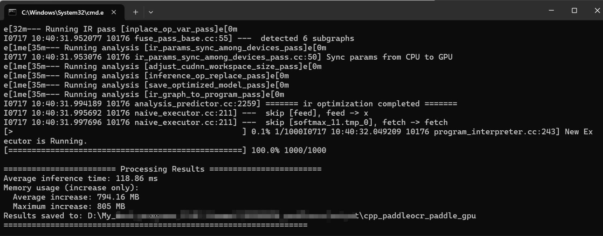

[English](windows_vs2019_build_en.md) | 简体中文

- [CMake 编译指南](#cmake-编译指南)
  - [1. 环境准备](#1-环境准备)
    - [1.1 安装必须环境](#11-安装必须环境)
    - [1.2 下载 OpenVINO C++预测库和 Opencv](#12-下载-openvino-c预测库和-opencv)
      - [1.2.1 下载 OpenVINO C++ 预测库](#121-下载-openvino-c-预测库)
      - [1.2.2 安装配置OpenCV](#122-安装配置opencv)
  - [2. 开始运行](#2-开始运行)
    - [Step1: 执行cmake配置](#step1-执行cmake配置)
    - [Step2: 生成可执行程序](#step2-生成可执行程序)
    - [Step3: 预测](#step3-预测)
  - [FAQ](#faq)

# CMake 编译指南

PaddleOCR在Windows 平台下基于`Visual Studio 2019 Community` 进行了测试。微软从`Visual Studio 2017`开始即支持直接管理`CMake`跨平台编译项目，但是直到`2019`才提供了稳定和完全的支持，所以如果你想使用CMake管理项目编译构建，我们推荐你使用`Visual Studio 2019`环境下构建。

## 1. 环境准备

### 1.1 安装必须环境

* Visual Studio 2019
* CMake 3.22+

请确保系统已经安装好上述基本软件，我们使用的是`VS2019`的社区版。

### 1.2 下载 OpenVINO C++预测库和 Opencv

#### 1.2.1 下载 OpenVINO C++ 预测库

1. 在OpenVINO官网下载适用于Windows平台的OpenVINO Archives， [下载地址](https://www.intel.com/content/www/us/en/developer/tools/openvino-toolkit/download.html?PACKAGE=OPENVINO_BASE&VERSION=v_2025_2_0&OP_SYSTEM=WINDOWS&DISTRIBUTION=ARCHIVE)
2. 将OpenVINO Archives解压至指定目录，如`D:\AI_framework\OpenVINO`

#### 1.2.2 安装配置OpenCV

1. 在OpenCV官网下载适用于Windows平台的Opencv， [下载地址](https://github.com/opencv/opencv/releases)
2. 运行下载的可执行文件，将OpenCV解压至指定目录，如`D:\projects\opencv`

## 2. 开始运行

### Step1: 执行cmake配置

```shell
mkdir build && cd build
cmake -G "Visual Studio 16 2019" -A x64 -DOPENCV_DIR="D:/Project_source_code/opencv/opencv-4.12.0/build" -DOPENVINO_DIR="D:\OpenVINO\openvino_toolkit_windows_2025.3.0.19807.44526285f24_x86_64" ..
```

**注意：**

  1. 下载[dirent.h](https://paddleocr.bj.bcebos.com/deploy/cpp_infer/cpp_files/dirent.h)，并拷贝到 Visual Studio 的 include 文件夹下，如`C:\Program Files (x86)\Microsoft Visual Studio\2019\Community\VC\Auxiliary\VS\include`。
  2. 遇到报错 `unable to access 'https://github.com/LDOUBLEV/AutoLog.git/': gnutls_handshake() failed: The TLS connection was non-properly terminated.`， 将 `deploy/cpp_infer/external-cmake/auto-log.cmake` 中的github地址改为 https://gitee.com/Double_V/AutoLog 地址即可。

### Step2: 生成可执行程序

```shell
cmake --build . --config Release
```

**注意：**

1. 如果遇见“accumulate”报错，在`autolog.h`中添加`#include <numeric>`。
2. 再次运行命令，即可在`build/Release/`文件夹下看见`ppocr-ov.exe`文件。

运行之前，将下面文件拷贝到`build/Release/`文件夹下

1. `opencv/build/x64/vc16/bin/opencv_world4100.dll`
2. `openvino/runtime/bin/intel64/Release/cache.json`
3. `openvino/runtime/bin/intel64/Release/openvino.dll`
4. `openvino/runtime/bin/intel64/Release/openvino_intel_cpu_plugin.dll`
5. `openvino/runtime/bin/intel64/Release/openvino_intel_gpu_plugin.dll`
6. `openvino/runtime/bin/intel64/Release/openvino_intel_npu_plugin.dll`
7. `openvino/runtime/bin/intel64/Release/openvino_ir_frontend.dll`
8. `openvino/runtime/3rdparty/tbb/bin/tbb12.dll`
9. `openvino/runtime/3rdparty/tbb/bin/tbbbind_2_5.dll`
10. `openvino/runtime/3rdparty/tbb/bin/tbbmalloc.dll`
11. `openvino/runtime/3rdparty/tbb/bin/tbbmalloc_proxy.dll`
12. `ppocr_cpp_infer/src/configs/ppocr_keys_v1.txt`
13. `ppocr_cpp_infer/src/configs/configs/OCR.yaml`
14. `ppocr_cpp_infer/build/third_party/clipper_ver6.4.2/cpp/Release/polyclipping.dll`

### Step3: 预测

上述`Visual Studio 2019`编译产出的可执行文件在`build/Release/`目录下，打开`cmd`，并切换到`PaddleOCR_OpenVINO_CPP\build\Release`：

```shell
cd /d PaddleOCR_OpenVINO_CPP\build\Release
```

可执行文件`ppocr.exe`即为样例的预测程序，其主要使用方法如下，更多使用方法可以参考[说明文档](../readme.md)`运行demo`部分。

```shell
# 切换终端编码为utf8
CHCP 65001
# 执行预测
ppocr.exe ocr --input=image_dir --text_detection_model_name=PP-OCRv4_mobile_det --text_detection_model_dir=model_dir --text_recognition_model_name=PP-OCRv4_mobile_rec --text_recognition_model_dir=model_dir --save_path=save_dir --device=npu --text_recognition_batch_size=1
```

识别结果如下：



## FAQ

* 运行时，弹窗报错提示`应用程序无法正常启动(0xc0000142)`，并且`cmd`窗口内提示`You are using Paddle compiled with TensorRT, but TensorRT dynamic library is not found.`，把tensort目录下的lib里面的所有dll文件复制到release目录下，再次运行即可。
