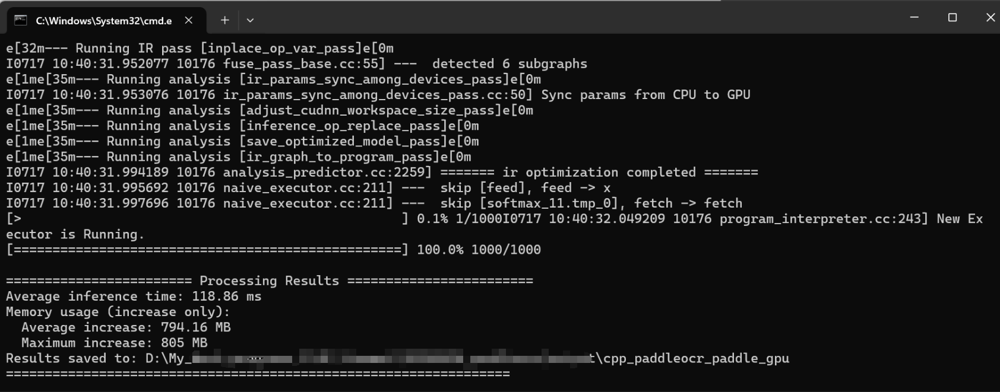

English| [简体中文](windows_vs2019_build.md)

- [CMake Compilation Guide](#cmake-compilation-guide)
  - [1. Environmental Preparation](#1-environmental-preparation)
    - [1.1 Installation environment](#11-installation-environment)
    - [1.2 Download OpenVINO and OpenCV](#12-download-openvino-and-opencv)
      - [1.2.1 Download OpenVINO](#121-download-openvino)
      - [1.2.2 Installation and ConfigurationOpenCV](#122-installation-and-configurationopencv)
  - [2. Start running](#2-start-running)
    - [Step1: Execute cmake configuration](#step1-execute-cmake-configuration)
    - [Step2: Generate an executable program](#step2-generate-an-executable-program)
    - [Step3: predict](#step3-predict)
  - [FAQ](#faq)

# CMake Compilation Guide

PaddleOCR has been tested on Windows using Visual Studio 2019 Community. Microsoft has supported direct management of CMake cross-platform build projects since Visual Studio 2017, but stable and complete support wasn't provided until 2019. Therefore, if you want to use CMake to manage your project builds, we recommend building with Visual Studio 2019.

## 1. Environmental Preparation

### 1.1 Installation environment

* Visual Studio 2019
* CMake 3.22+

Please make sure that the above basic software has been installed on the system. We use the community edition of `VS2019`.

### 1.2 Download OpenVINO and OpenCV

#### 1.2.1 Download OpenVINO

1. Download the OpenVINO Archives for Windows from the OpenVINO official website. [Download link](https://www.intel.com/content/www/us/en/developer/tools/openvino-toolkit/download.html?PACKAGE=OPENVINO_BASE&VERSION=v_2025_2_0&OP_SYSTEM=WINDOWS&DISTRIBUTION=ARCHIVE)
2. Unzip the OpenVINO Archives to a specified directory, such as `D:\AI_framework\OpenVINO`

#### 1.2.2 Installation and ConfigurationOpenCV

1. Download OpenCV for Windows from the official OpenCV website: [Download link](https://github.com/opencv/opencv/releases)
2. Run the downloaded executable file and extract OpenCV to a specified directory, such as `D:\projects\opencv`

## 2. Start running

### Step1: Execute cmake configuration

```shell
mkdir build && cd build
cmake -G "Visual Studio 16 2019" -A x64 -DOPENCV_DIR="D:/Project_source_code/opencv/opencv-4.12.0/build" -DOPENVINO_DIR="D:\OpenVINO\openvino_toolkit_windows_2025.3.0.19807.44526285f24_x86_64" ..
```

**Note:**

1. Download [dirent.h](https://paddleocr.bj.bcebos.com/deploy/cpp_infer/cpp_files/dirent.h) and copy it to the include folder of Visual Studio, for example, `C:\Program Files (x86)\Microsoft Visual Studio\2019\Community\VC\Auxiliary\VS\include`.
2. If you encounter the error `unable to access 'https://github.com/LDOUBLEV/AutoLog.git/': gnutls_handshake() failed: The TLS connection was non-properly terminated.`, replace the GitHub address in `deploy/cpp_infer/external-cmake/auto-log.cmake` with the address https://gitee.com/Double_V/AutoLog.

### Step2: Generate an executable program

```shell
cmake --build . --config Release
```

**Note:**

1. If you encounter an "accumulate" error, add `#include <numeric>` to `autolog.h`.

2. Run the command again and you should see the `ppocr-ov.exe` file in the `build/Release/` folder.

Before running, copy the following files to the `build/Release/` folder.

1. `opencv/build/x64/vc16/bin/opencv_world4100.dll`
2. `openvino/runtime/bin/intel64/Release/cache.json`
3. `openvino/runtime/bin/intel64/Release/openvino.dll`
4. `openvino/runtime/bin/intel64/Release/openvino_intel_cpu_plugin.dll`
5. `openvino/runtime/bin/intel64/Release/openvino_intel_gpu_plugin.dll`
6. `openvino/runtime/bin/intel64/Release/openvino_intel_npu_plugin.dll`
7. `openvino/runtime/bin/intel64/Release/openvino_ir_frontend.dll`
8. `openvino/runtime/3rdparty/tbb/bin/tbb12.dll`
9. `openvino/runtime/3rdparty/tbb/bin/tbbbind_2_5.dll`
10. `openvino/runtime/3rdparty/tbb/bin/tbbmalloc.dll`
11. `openvino/runtime/3rdparty/tbb/bin/tbbmalloc_proxy.dll`
12. `ppocr_cpp_infer/src/configs/ppocr_keys_v1.txt`
13. `ppocr_cpp_infer/src/configs/configs/OCR.yaml`
14. `ppocr_cpp_infer/build/third_party/clipper_ver6.4.2/cpp/Release/polyclipping.dll`

### Step3: predict

The executable file compiled by `Visual Studio 2019` is in the `build/Release/` directory. Open `cmd` and switch to `PaddleOCR_OpenVINO_CPP\build\Release`:

```shell
cd /d PaddleOCR_OpenVINO_CPP\build\Release
```

The executable file `ppocr.exe` is the sample predict program. Its main usage is as follows. For more usage instructions, see the `Running the demo` section in the [Readme.md](../readme_en.md).

```shell
# Switch terminal encoding to utf8
CHCP 65001
# Execute predict
ppocr.exe ocr --input=image_dir --text_detection_model_name=PP-OCRv4_mobile_det --text_detection_model_dir=model_dir --text_recognition_model_name=PP-OCRv4_mobile_rec --text_recognition_model_dir=model_dir --save_path=save_dir --device=npu --text_recognition_batch_size=1
```

The recognition results are as follows:



## FAQ

* During runtime, a pop-up window displays an error message saying `The application cannot start normally (0xc0000142)`, and a prompt appears in the `cmd` window saying `You are using Paddle compiled with TensorRT, but TensorRT dynamic library is not found.`. Copy all the dll files in the `lib` directory under the `tensor` directory to the `release` directory and run the program again.
